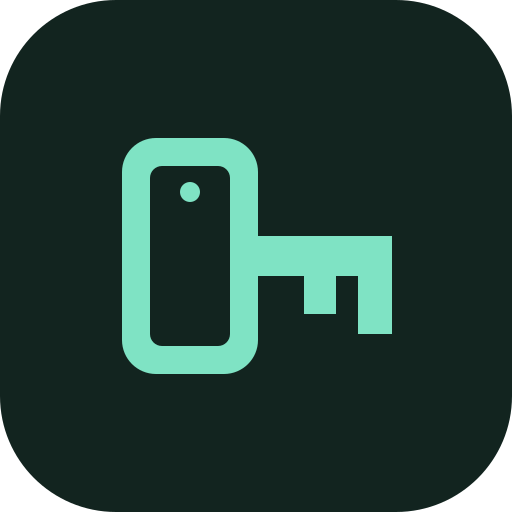

#  fidont

<picture><source media="(prefers-color-scheme: dark)" srcset="https://www.shieldcn.dev/github/downloads/Z1xus/fidont.svg?variant=secondary&amp;size=xs&amp;mode=dark"></picture>
<picture><source media="(prefers-color-scheme: dark)" srcset="https://www.shieldcn.dev/github/last-commit/Z1xus/fidont.svg?variant=secondary&amp;size=xs&amp;mode=dark"></picture>

Stop paying for YubiKeys, use your Android phone as a FIDO2/WebAuthn key instead.

It works as:

- a passkey provider for apps and sites on the phone itself
- a key for browsers on other devices, you scan their passkey QR code with the app
- an NFC key, just tap the phone on a reader
- a USB key for everything else, through the [dongle](#dongle)
- a Bluetooth key for browsers on a computer that you paired the phone with

Your keys are made inside the phone's secure hardware (StrongBox, or the TEE on phones without it) and nothing can copy them out of there. Using one always takes your fingerprint or PIN.

There is no sync, so if you lose the phone or remove the screen lock they are GONE, unless you turned on [backup](#backup) first.

> [!NOTE]
> FIDO2/WebAuthn compatible, but not FIDO certified. Sites that only accept certified keys will reject it.

## Install

Needs Android 14 or newer.  
Grab the APK from [releases](https://github.com/Z1xus/fidont/releases) and install it.

## Dongle

The dongle is an ESP32-S3 board that shows up as a USB security key and passes every request to the phone over Bluetooth.  
It holds no keys, so if you lose it you just flash another one.

Plug the board into the phone and tap "Set up", the app flashes and pairs it in one go.  
And if the board isn't found, hold BOOT while plugging it in.

If flashing from the phone doesn't work, use the [web flasher](https://z1xus.github.io/fidont/) and then "Pair over Bluetooth" in the app.

Also the phone only talks to the dongle while the app is open, so open it when something asks for the key.

## Backup

Backup is off by default, because a key that was made inside StrongBox can't be copied out, not even by the app.  
If you turn on "Allow backup" in settings, new passkeys get made in the app and imported into StrongBox instead, and the phone keeps an encrypted copy of each one that only opens with your fingerprint or PIN.

But passkeys from before you turned it on stay locked to the phone, so turn it on first if you want backups.

Export saves those copies to a file, encrypted with a password (PBKDF2 and AES-256-GCM), or plain if you leave the password empty.  
Import on another phone puts them into its keystore.

## Other password managers

fidont doesn't replace Bitwarden (or Google Password Manager, 1Password etc), it does a different job.  
Those sync your passkeys everywhere, fidont keeps them on one phone and works like a hardware key, so use both.

Android 14 lets you turn on more than one passkey provider, so they just show up next to each other when a site asks.  
What I'd actually do is keep the daily passkeys in the password manager and register fidont as the 2FA key for the password manager itself, and for the accounts you really care about.

It also supports hmac-secret and PRF, which is what Bitwarden's passkey login and LUKS disk encryption through systemd-cryptenroll need.

## Privacy

The app has no accounts or analytics (or ads), and passkeys only leave the phone if you export them yourself.

But the QR flow needs a relay between the phone and the computer.  
Whichever relay you use gets to see your IP and when you connected.  
The messages themselves are E2EE, so it can't read them or sign in as you.

You pick the relay in settings:

- fidont is the default, it's mine at cable.ahhkeysummo2d.com and runs the [code in this repo](relay). It keeps no logs and stores nothing, a tunnel just sits in memory for 2 minutes at most. It sits behind Cloudflare, so Cloudflare sees the same as me.
- Google is cable.ua5v.com, the one Chrome and Android use. I don't know what it logs.
- Custom is a relay you run yourself.

### Running your own relay

```sh
docker build -t fidont-relay relay
docker run -p 8080:8080 fidont-relay
```

Browsers get the domain from a relay ID (256 to 65535), so you can't pick it yourself.  
`docker run fidont-relay -domain <id>` prints the one for your ID, register it and point it at the relay with TLS in front.  
Then pick Custom under QR code relay in settings and enter your ID.

## Build

Needs JDK 17+, the Android SDK, Go and Docker.  
The firmware goes first because the app bundles it.

```sh
docker run --rm -v "$PWD:/project" -w /project/firmware espressif/idf:v6.1 \
    idf.py build merge-bin -o ../../android/src/main/assets/firmware.bin
./gradlew :android:assembleDebug
go build -C relay
```

## Credits

The QR flow is reimplemented from [Chromium's hybrid transport](https://source.chromium.org/chromium/chromium/src/+/main:device/fido/cable/) and tested against [fenleon/passkey](https://github.com/fenleon/passkey).
